# Chatty
A desktop real-time chat app for people to find friends based on their interests.
- python for backend
- kivyMD for frontend
- firebase firestore as database

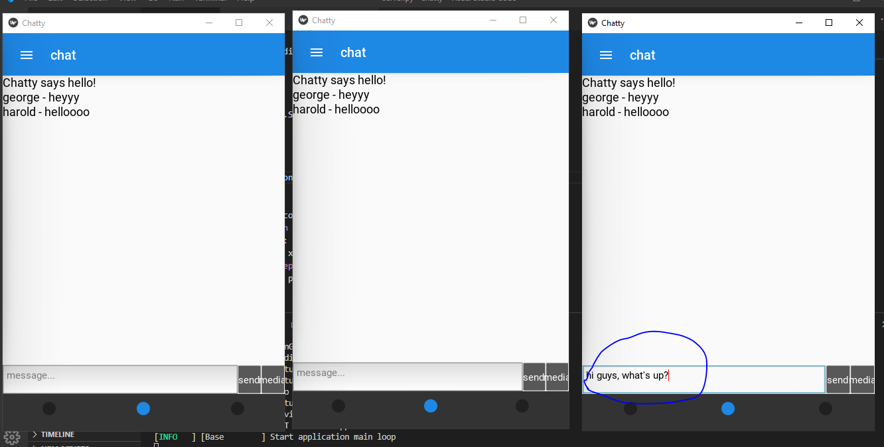

## Features with Some Screenshots

### Signup

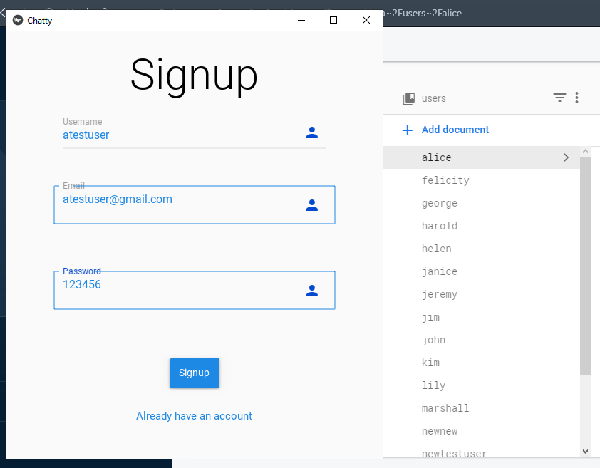

### Login 

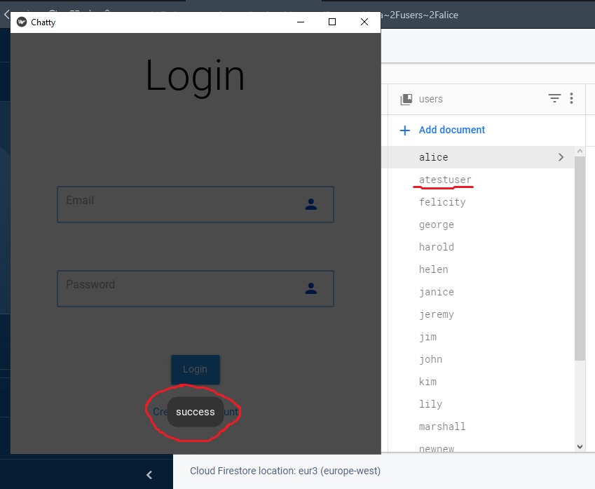

### Profile

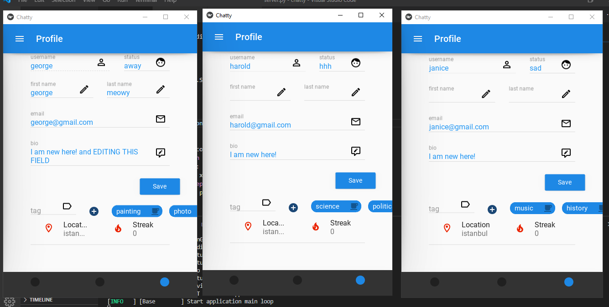

### Adding a new friend

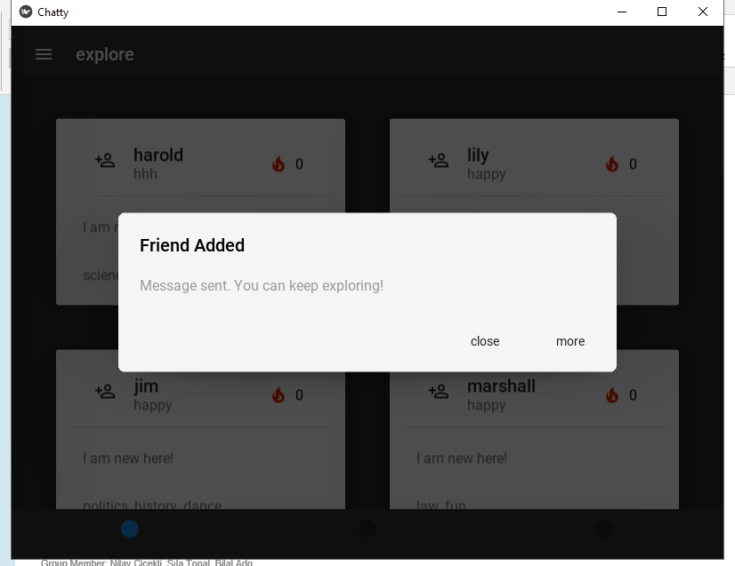

### Friend list

### Private chat

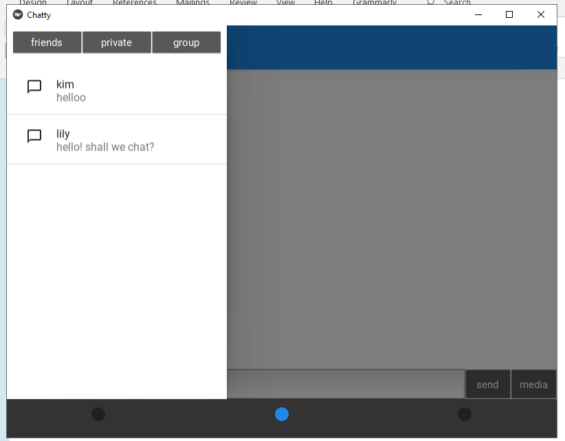

### Tag management (interests)

Before removing the `coding` tag:
- 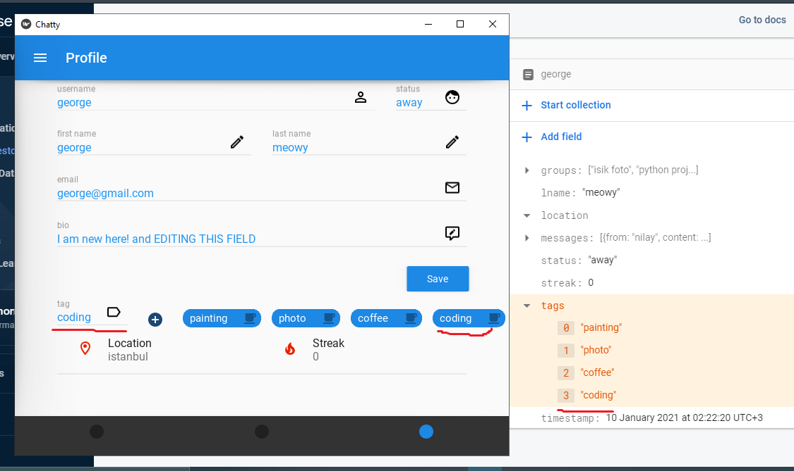

After removing the `coding` tag:
- 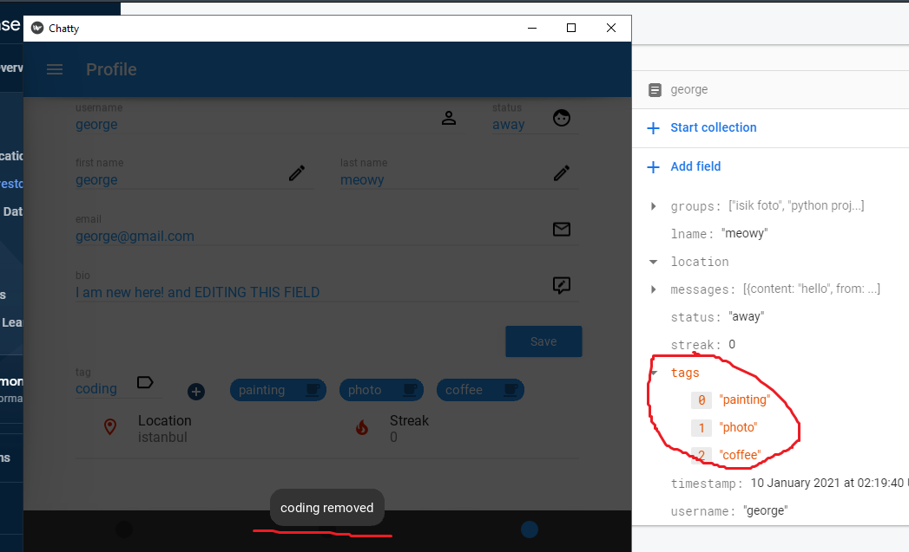

### Friend matching based on interest

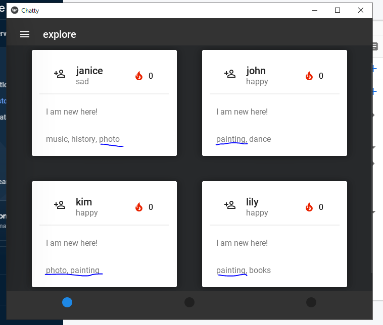

### Firebase functionality

Firebase before edit:
- 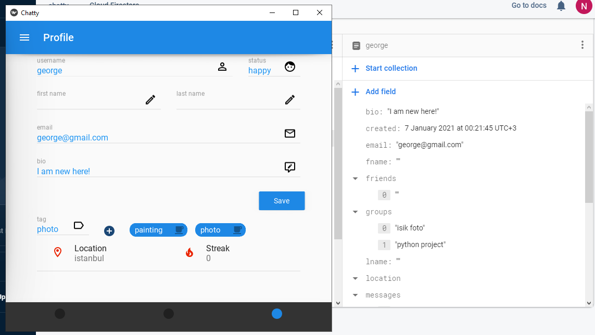

Firebase after edit:
- 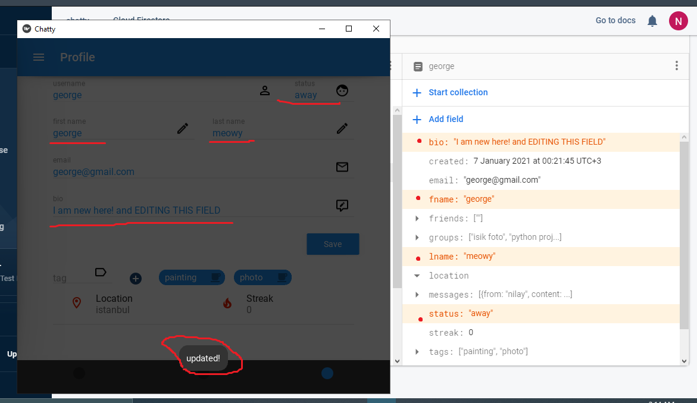

### Error Handling

Can't add the same tag:
- 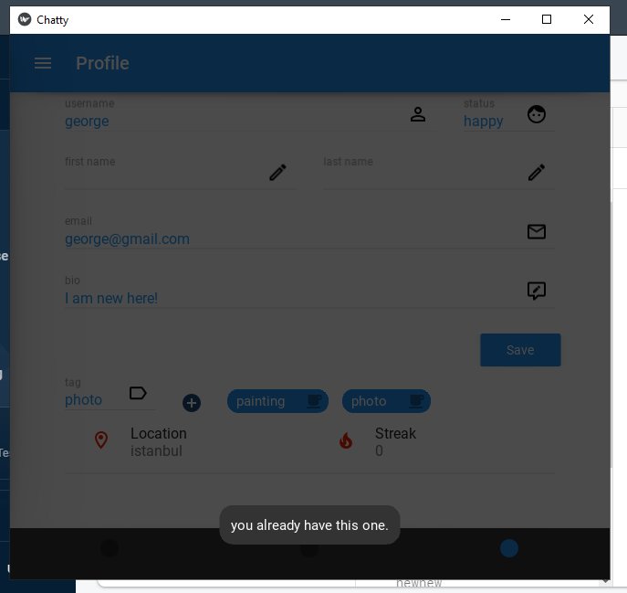

Error:
- 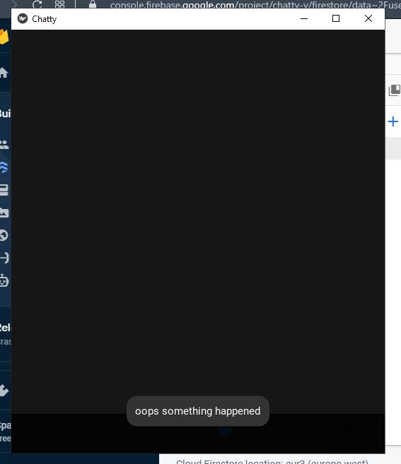

Signup error:
- 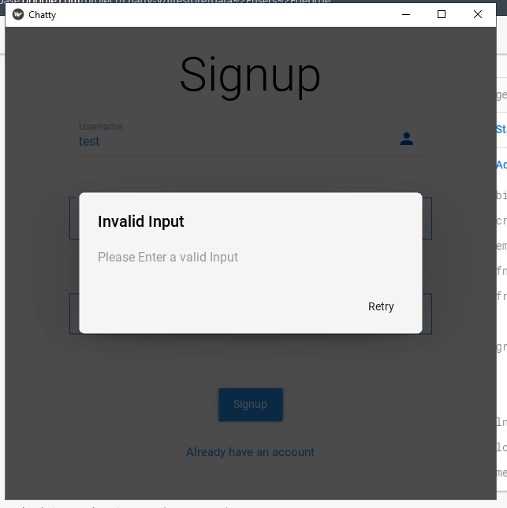
